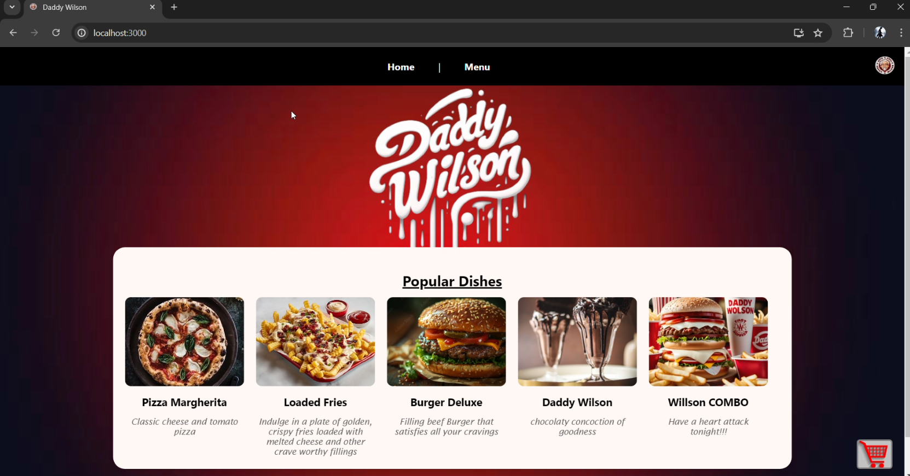
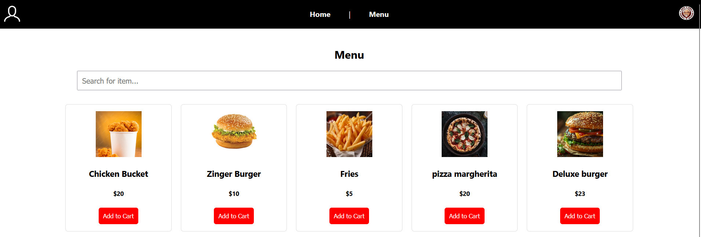
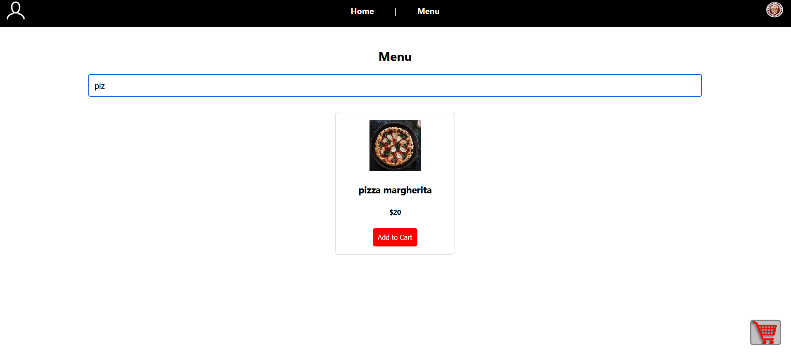
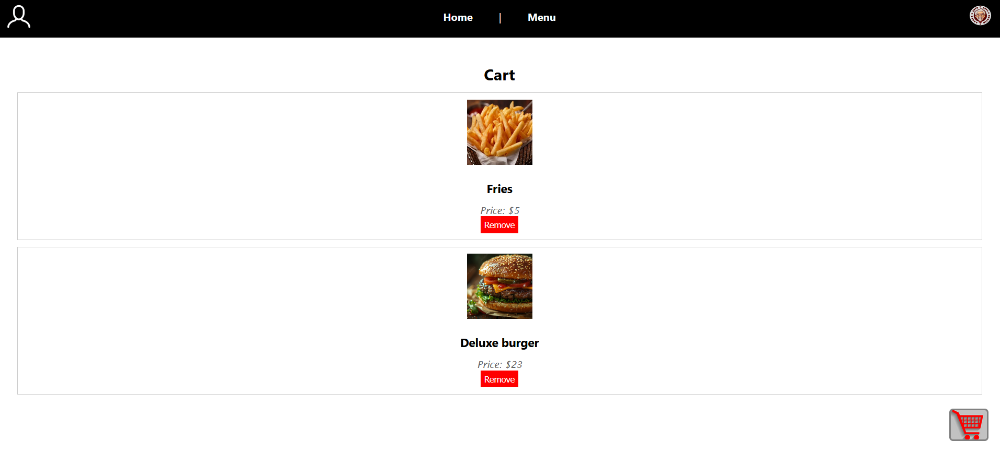

# Restaurant App 🍽️

This is a frontend-only restaurant web application built using **React.js**. The project was created to help familiarize myself with React concepts, focusing on UI design and interactive components.

## Features

- 🔍 **Search Functionality**: Easily search for food items from the menu in real-time.
- 🧾 **Dynamic Menu**: Browse a visually appealing list of food items with images, names, and prices.
- 🛒 **Cart System**: 
  - Add items to your cart.
  - Remove items from the cart.
  - View updated cart totals.

## Tech Stack

- **React.js** (Frontend Framework)
- **CSS** (Styling)

> ⚠️ Note: This is a **frontend-only** application. There is no backend or database integration. All data is handled within the React app.

## Screenshots

